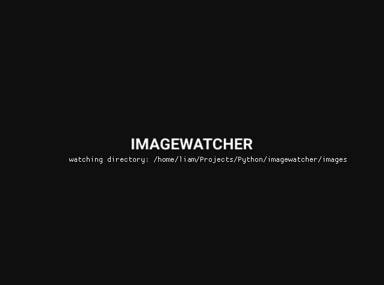

# ImageWatcher



A command line utility to explore and watch for image creation in a folder.

Built in Python using [DearPyGui](https://github.com/hoffstadt/DearPyGui) and [watchdog](https://github.com/gorakhargosh/watchdog).

## Installation

clone the repo
```
git clone https://github.com/burstMembrane/imagewatcher
```


create a virtual env for the project

``` bash
virtualenv imagewatcher
source virtualenv/bin/activate
```

install requirements.txt

```bash
pip install -r requirements.txt
```

## Optional

You can install the package with pyinstaller
```bash
pip install pyinstaller
chmod +x install.sh
./install.sh
```

## Usage

```bash
python imagewatcher.py -d </path/to/directory/to/watch>
```

## Key bindings

```bash
ESC -- quit
ARROW_KEYS -- cycle images in folder
f -- toggle fullscreen
```